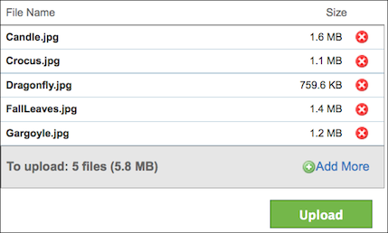

# Understanding Infusion Components #

Every Infusion application is structured as a set of **components**. An Infusion component can represent
a visible component on screen, a collection of related functionality such as an **object** as in object-orientation,
or simply a unit of work or relationship between other components. This page provides resources to help you understand components, how they're designed and how to work with them.

If you're creating an entire web application, your application would be implemented as a component that
coordinates interactions between other components that handle the different parts of your application.

## Examples ##

To help understand how a widget or application might be designed using components, consider some of
the components in the Infusion Component Library:

### Progress ###


The Infusion Progress component is single component with no subcomponents. It has a number of UI elements
that work together and are updated programmatically to show the progress of some activity. It has a 
pretty simple purpose and function, one that doesn't make much sense to try to chunk up into multiple components.

### Inline Edit ###


The Inline Edit component allows user to edit text in place, without switching to a new screen, by 
simply switching into an in-place edit mode. The view mode is implemented one way, with certain functionality (i.e. a tooltip, an affordance to edit), and the edit mode is implemented differently: it's an edit field. Conceptually, these two modes are rather different, and so they're implemented as two separate subcomponents of the main Inline Edit component.

### Uploader ###



The Uploader allows users to add several files to a queue and then upload them all at once. It is actually 
made up of several subcomponents: It has the file queue view, which displays the files currently in the queue; it has a total progress bar at the bottom. In turn, the file queue view component has its own subcomponents.

## What Does A Component Look Like? ##

A component is a regular JavaScript object that has certain characteristics. The most simple components 
have a typeName and an id, but typical components will have more:

Most will have:

* a **creator function**
  * the function that implementors invoke, which returns the component object itself
* configuration options
  * various values that control the operation of the component, which can be overridden by implementors 
        to customize the component
* public functions

Depending on what the component is for, some will include infrastructure to support

* events
* a model
* a view
* a renderer

New kinds of components are created by passing configuration information to the '[fluid.defaults](https://github.com/fluid-project/infusion/blob/infusion-1.5/src/framework/core/js/Fluid.js#L1519-L1539)' function. 
This function will create the **creator function** that will be used to instantiate the component.
The Framework provides [supports for automatically creating components of various types, or 'grades'](ComponentGrades.md); 
as well, developers can create their own grades.

## Instantiating A Component ##
*Example:*
```
var myInlineEdit = fluid.inlineEdit(".title-container", {
    styles: {
        edit: "demo-title-edit demo-edit"
    },
    strings: {
        defaultViewText: "Edit this",
        defaultFocussedViewText: "Edit this (click or press enter)"
    }
});
```