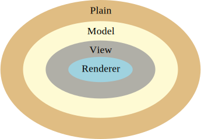

---
Part of the [Getting Started with Infusion Tutorial](GettingStartedWithInfusion.md)

---

The Infusion Framework provides lots of supports for creating components. We have defined a number of different types, or grades, of component, and the Framework will automatically set up different stuff for you depending on which grade of component you create. (For more advanced information about grades, see [Component Grades](../ComponentGrades.md).)

The basic types are:

* **little component**: the most basic type
* **model component**: for components that will have maintain abstract data model
* **evented component**: for components that want to fire events
* **view component**: for components that have a user interface
* **renderer component**: for components that want to render the user interface using a template

These types of components build upon each other, a teeny little bit like inheritance:

* **model** and **evented components** add support for models and events (respectively) to **little components**
* **view components** support models and events, and also add support for views.
* **renderer components** are **view components** with the [Renderer](../Renderer.md) added.

For this tutorial, we suggest you work through all of the examples in order, to understand what each type of component offers. That way, you'll be in a better position to decide which grade you'll need for your components. Regardless of grade, the basic process for creating a component is the same. The next page in this tutorial will explain this basic process using the **little component**, but you will see the same process for each of the component types.
