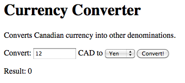

# View Components #

---
Part of the [Getting Started with Infusion Tutorial](GettingStartedWithInfusion.md)

---

In most cases, you will likely be creating a component that will actually want to do something with your HTML page: process form input, update displays, etc. `little`, `evented` and `model` components don't provide any support for this: you'll need a **view component**.

A view component provides support for a model and events (i.e. it is a model component and an evented component). It also provides supports for interaction with the DOM. The most useful of these is the [DOM Binder](../DOMBinder.md). If your application has a user interface, you likely have a list of DOM elements you're interested in working with. A DOM Binder provides very easy, configurable access to these elements.

## Declaring a View Component ##

To create a view component, you need to use the **viewComponent** grade. To do this:

* specify a grade of `fluid.viewComponent`, and
* include a `selectors` property in your defaults containing your component's model.

```javascript
fluid.defaults("tutorials.viewBearingComponent", {
    gradeNames: ["fluid.viewComponent", "autoInit"],
    ...
    selectors: {
        selector1: ".class1",
        selector2: ".class2"
    }
});
```

_**Note:** View components automatically also provide support for model and events, so you don't need to include those in your `gradeNames` list._

### Selectors ###

The `selectors` property in your defaults is the list of DOM elements you want to work with in your interface. The object is a list of named [CSS-based selectors](http://docs.jquery.com/Selectors). The names should be generic and refer to the nature of the interface element, such as "saveButton" or "sliderHandle." By specifying your selectors on your component's defaults, integrators can override the selectors without requiring any changes to your component.

## Example: Currency Converter ##

Consider a simple user interface for the currency converter example we looked at earlier:



There are several elements we'll need to identify:

* the text input field
* the currency selection drop-down
* the "Convert!" button
* the output of the results

We make sure our HTML has unique classes or IDs on each of these elements. The Infusion convention is to use class names that are prefaced with `flc-<componentName>` (where `flc` is short for "fluid component"). We'll adopt a similar convention here, and use a preface of `tut-currencyConverter-` for "tutorial currency converter". So here's what this might look like:

```html
<h1>Currency Converter</h1>

<p>Converts Canadian currency into other denominations.</p>

<p>
    Convert: <input class="tut-currencyConverter-amount" type="text" size="10"/> CAD to
    <select class="tut-currencyConverter-currency-selecter">
        <option value="1.02">USD</option>
        <option value="1">Yuan</option>
        <option value="1">Yen</option>
    </select> <button class="tut-currencyConverter-convert-button">Convert!</button>
</p>

<p>Result: <span class="tut-currencyConverter-result">0</span></p>
```

So far, the JavaScript to instantiate this component and specify these selectors looks like this:

```javascript
fluid.defaults("tutorials.currencyConverter", {
    gradeNames: ["fluid.viewComponent", "autoInit"],
    selectors: {
        amount: ".tut-currencyConverter-amount",
        currency: ".tut-currencyConverter-currency-selecter",
        convertButton: ".tut-currencyConverter-convert-button",
        result: ".tut-currencyConverter-result"
    }
});
```

So far we have not added any behaviour to this skeleton view component - we'll orchestrate together all the model, event and view code we've seen so far together into a working component in our final section on [Renderer Components](RendererComponents.md).
